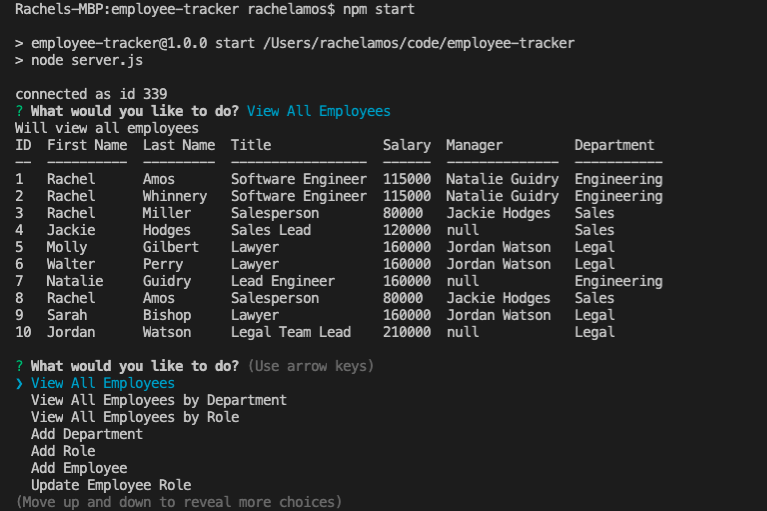

# Employee Tracker
## Table of Contents

1. [Description](#description)
2. [Installation](#installation-instructions)
3. [Usage](#usage)
4. [Contributing](#contributers)
5. [License](#license)

### Description
An app that manages a company's employees using Node.js, Express, Inquirer, and MySQL.

### Installation Instructions
1. Download the code from the repo.
2. Within the terminal, npm init and npm install.
3. Use the schema.sql file to create the database.
4. Using the .env.EXAMPLE file, create an .env with your credentials.

### Usage
From the terminal, enter 'npm start'.

**Accessing Company's Employees**

[Link to Application](https://github.com/rachelamos/employee-tracker.git)

[Demo of My App](https://drive.google.com/file/d/1aN117cFIkp8CSk3SE-yVzWcWdGDme5aI/view)

### Questions
If you have any other questions, you can reach me:
- via email: rachelamos35@gmail.com
- via GitHub: https://github.com/rachelamos

### License
This project is covered under the [MIT](LICENSE) license.

### Contributers
© Rachel Amos